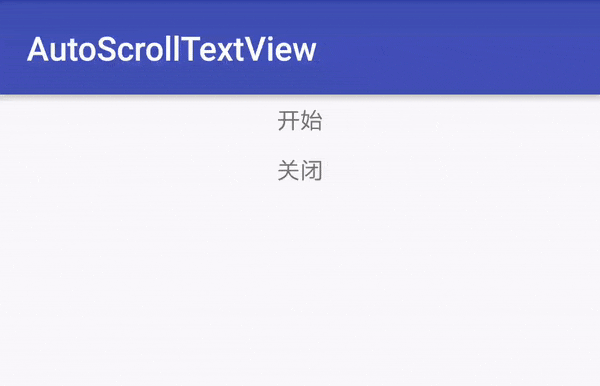

# [AutoScrollTextView](https://github.com/ronghao/FrameAnimationView) [](https://jitpack.io/#ronghao/AutoScrollTextView) [](https://travis-ci.org/ronghao/AutoScrollTextView)  [](https://raw.githubusercontent.com/ronghao/CacheManage/master/LICENSE) 
android 上下滚动播放与走马灯效果结合

# 实现原理
+ 实现上下滚动
    + 使用[ViewSwitcher](https://android.googlesource.com/platform/frameworks/base/+/refs/heads/master/core/java/android/widget/ViewSwitcher.java)
+ 使用scrollTo(x,y)和runable循环调用，移动textview，形成走马灯效果

# 演示


# 项目添加方法
在根 build.gradle中添加

	allprojects {
		repositories {
			...
			maven { url 'https://jitpack.io' }
		}
	}
在项目build.gradle中添加  

	dependencies {
	    compile 'com.github.ronghao:AutoScrollTextView:1.0.0'
	}

# 使用

```
<com.haohaohu.autoscrolltextview.MarqueeTextView
        android:id="@+id/main_marguee_text"
        android:layout_width="match_parent"
        android:layout_height="20dp"
        />
```


# 关于
+ 个人博客：[www.haohaohu.com](http://www.haohaohu.com/)
+ 如果你也喜欢这个库，Star一下吧，欢迎Fork

# License

    Copyright 2016 lcodecorex

    Licensed under the Apache License, Version 2.0 (the "License");
    you may not use this file except in compliance with the License.
    You may obtain a copy of the License at

       http://www.apache.org/licenses/LICENSE-2.0

    Unless required by applicable law or agreed to in writing, software
    distributed under the License is distributed on an "AS IS" BASIS,
    WITHOUT WARRANTIES OR CONDITIONS OF ANY KIND, either express or implied.
    See the License for the specific language governing permissions and
    limitations under the License.
